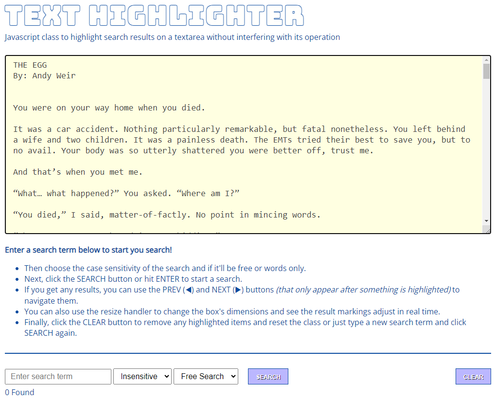

# Text Highlighter

Vanilla JS class to highlight search results in a textarea while maintaining the area's functionality.

Since one can't style the text in a textarea, as it is not HTML, this class comes to the rescue allowing you to highlight any text in a textarea. Such as in search results.





#### [CHECK OUT THE DEMO](https://wstaeblein.github.io/texthighlighter/){:target="_blank"}


## Features

- No dependencies.
- No configuration. Just instantiate the class and call a method.
- Can be used in as many textareas as needed, just instantiate for each one.
- Responsive. The markings will adjust to screen size, textarea size and scroll.
- Keeps the original background from the textarea.
- Can be properly destroyed. Will remove all events and structure.
- Can choose between case sensitive and insensitive search.
- Can search freely or words only.
- Provides a count of how many results were found.
- Can navigate the search results, bringing them to view as needed.


Its use is very straightforward, instantiate the class for the textarea you need and call the search method to highlight the text you pass in the first argument. The second argument is optional and takes a boolean that if true will make the search case sensitive. The default is case insensitive. The last argument also takes a boolean that, if true, will perform a word search. Otherwise it's a free search, where any part of words can be matched.


## Usage & Code Examples

Add the following files to your project:
- texthighlighter.js
- texthighlighter.css


```javascript
let tarea = document.getElementById('txt');
let hilite = new textHighlight(tarea);

let searchResult = 'Some Expression';
let sens = true;                        // Case sensitive. Optional, default: false
let word = true;                        // Perform a words only search. Optional, default: false
hilite.search(searchResult, sens, word);
```

To access how many occurrences were found, use:

```javascript
let count = hilite.count();
```

You can navigate back and forth among the highlighted results using the prev and next methods. This navigation is cyclic, this means when the end is reached the next call takes you back to the begining and vice versa. Example below:

```javascript
let btnPrev = document.getElementById('prev');
let btnNext = document.getElementById('next');

btnPrev.addEventListener('click', hilite.prev);
btnNext.addEventListener('click', hilite.next);
```

Should you need to clear out the highlights, call the clear method.

```javascript
hilite.clear();
```

When it falls out of scope, just call the destroy method and all will be as it was before instantiation.

```javascript
hilite.destroy();
```


## About

This class was inspired by lonekorean's [highlight-within-textarea](https://github.com/lonekorean/highlight-within-textarea) JQuery plugin. Basically, I needed a similar functionality for a project but didn't want to include JQuery just for that and didn't find any other such code that was good enough. 

The main aim here was to provide highlighting for search results in a textarea.

This class was tested in Chrome 117 and Firefox 118.


## Licence

This project is licensed under the [MIT Licence](https://github.com/wstaeblein/texthighlighter/blob/main/LICENSE)